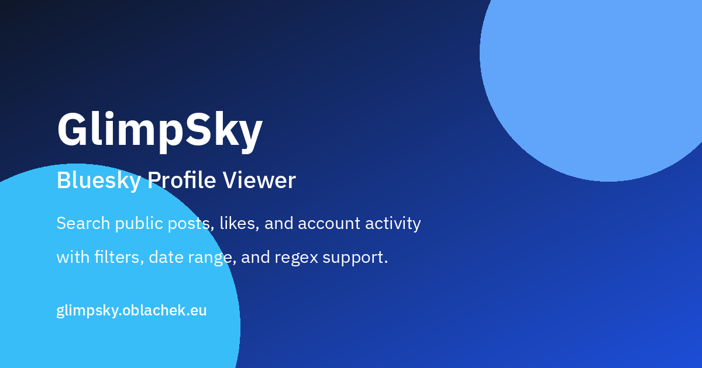

<h1> GlimpSky - Bluesky Profile Viewer</h1>



GlimpSky is a lightweight web tool for exploring public Bluesky accounts, threads, likes, followers, and related account activity from public AT Protocol endpoints.

## Why this exists

I wanted an easy way to inspect a profile beyond the default app view:

- show only original posts when needed (without reposts, replies, or quotes),
- search content with plain text or regex,
- search who a user replies to and which authors they like.

## What you can do

- View posts and likes for any public account
- View a full public thread tree from a single Bluesky post URL
- Attempt recovery of context-hidden thread posts when the underlying public record still exists
- Inspect thread breaks caused by blocked or unavailable placeholders
- Hide reposts, replies, and quotes
- Filter by date range
- Search post text
- Search authors across post authors, reply targets, and quoted authors
- Use regex in both search fields with `/pattern/flags`
- Sort oldest-first (loads all content first when required)
- See account info: joined date, last active, last follow
- Open followers/following lists, mutuals, and blocking

## Search behavior

- Plain text works by default
- Regex is optional and uses `/pattern/flags` format
- Example: `/hello.*/i`

## Run locally

```bash
python3 -m http.server 8000
```

Open `http://localhost:8000` in your browser.

Thread viewer: `http://localhost:8000/thread-viewer/`

Guides:
- `http://localhost:8000/guides/bluesky-thread-viewer/`

## Privacy and scope

- Uses publicly available Bluesky/AT Protocol data only
- No login required
- Static client-side app (no backend in this repo)

## Known limits

- `Blocked by` cannot be reliably computed from public APIs alone without an external indexer
- Some likes/posts can be unavailable (deleted posts, deactivated accounts, or inaccessible records)
- The thread viewer can surface `blockedPost` and `notFoundPost` gaps, but public APIs still do not identify which participant initiated a block relationship
- Some hidden thread posts can be recovered via direct post lookup or the author's public PDS record, but deleted or unavailable records still cannot be reconstructed

## Data sources and credits

All data is fetched from public Bluesky APIs and AT Protocol PDS endpoints. Inspired by [Clearsky](https://github.com/ClearskyApp06/clearskyservices) for blocking-related features and [Bluesky Likes by luizzeroxis](https://github.com/luizzeroxis/bluesky-likes/) for likes display patterns.
Vibecoded with ChatGPT and Claude.

## License

MIT. See `LICENSE`.

## Contributing

Suggestions, issues, and pull requests are welcome.
